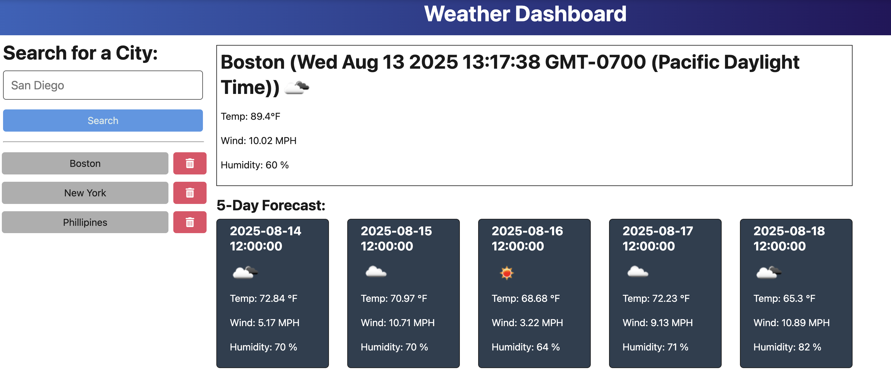

# Weather Dashboard

A modern weather dashboard application that provides real-time weather information and forecasts for cities worldwide.



## Features

- Search for weather by city name
- View current weather conditions with temperature, wind, and humidity
- 5-day weather forecast
- Search history with persistent storage
- Responsive design for all devices
- Real-time data from OpenWeatherMap API

## Quick Start

1. **Clone and install:**

   ```bash
   git clone <repository-url>
   cd Personal-Weather-Information
   npm run install
   ```

2. **Set up environment:**
   Create a `.env` file in the root directory:

   ```bash
   API_KEY=your_openweather_api_key_here
   PORT=3001
   ```

3. **Get API key:**

   - Sign up at [OpenWeatherMap](https://openweathermap.org/api)
   - Add your API key to the `.env` file

4. **Run the application:**
   ```bash
   npm run start:dev
   ```

## Usage

- **Search:** Enter a city name and click "Search"
- **View Weather:** See current conditions and 5-day forecast
- **History:** Previously searched cities appear in the sidebar
- **Delete:** Remove cities from your search history

## Technologies

- **Frontend:** TypeScript, Vite, Bootstrap
- **Backend:** Node.js, Express.js
- **API:** OpenWeatherMap
- **Storage:** JSON file-based database

## Live Demo

[Weather Dashboard](https://personal-weather-information.onrender.com/)

## Contact

- GitHub: [joshcord99](https://github.com/joshcord99)
- Email: joshcord99@gmail.com
